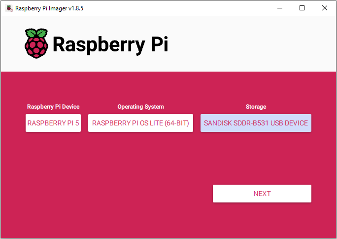
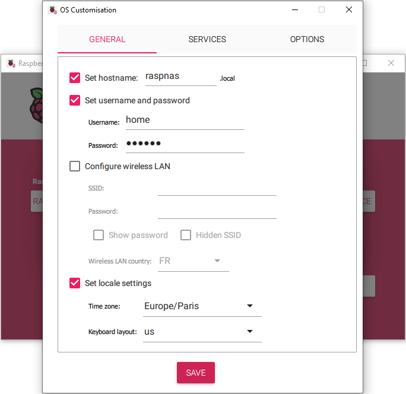
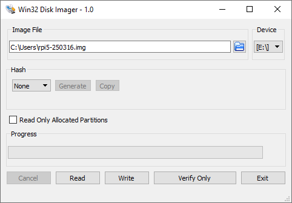

[Home](../../README.md) > KB-0001

# Network-Attached Storage with Raspberry Pi 5

This article provides a step-by-step guide on how to build and configure a **Network-Attached Storage** (NAS) using a Raspberry Pi 5. This setup offers a cost-effective and customizable solution for managing and accessing your data.

## Hardware

Basic configuration (`302.26 €`):
- Raspberry Pi 5 8GB Quad-Core [(Amazon)](https://www.amazon.fr/-/en/dp/B0CK2FCG1K)
- Raspberry Pi 5 USB-C 27W Power Supply [(Amazon)](https://www.amazon.fr/-/en/dp/B0CM46P7MC)
- SanDisk 128GB Extreme Pro microSDXC card [(Amazon)](https://www.amazon.fr/-/en/dp/B09X7DNF6G)
- Geekworm X1004 Dual M.2 NVMe SSD Shield [(Amazon)](https://www.amazon.fr/-/en/dp/B0D22JPQRB)
- Geekworm P579-H500 Enclosure with Active Cooler [(Amazon)](https://www.amazon.fr/-/en/dp/B0CT4P893Q)
- Eaton Ellipse ECO 650 Off-Line UPS EL650USBFR [(Amazon)](https://www.amazon.fr/dp/B0052QV9MK)

Main storage (`276.98 €`):
- 2x TeamGroup MP44L 2TB SLC Cache NVMe 1.4 PCIe Gen 4x4 M.2 2280 SSD [(Amazon)](https://www.amazon.fr/-/en/dp/B0B9Y48V73)

Backup storage (`129.50 €`):
- Western Digital 5TB External HDD USB3.0 [(Amazon)](https://www.amazon.fr/-/en/dp/B07X41PWTY)

:moneybag: The total cost estimation (`708.74 €`) is for March 11, 2025.

## Install Raspberry Pi OS Lite

Download and install the latest **Raspberry Pi Imager**:

> https://www.raspberrypi.com/software/

Insert the microSD card into your computer. If your computer does not have a microSD card slot, use a USB adapter:
- SanDisk MobileMate UHS-I microSD Reader/Writer USB3.0 [(Amazon)](https://www.amazon.fr/-/en/dp/B07G5JV2B5)

Open the **Raspberry Pi Imager** and set the following:
- Raspberry Pi Device: `Raspberry Pi 5`
- Operating System: `Raspberry Pi OS Lite (64-bit)`, found under the *Raspberry Pi OS (other)* group
- Storage: `<select the SD card>`

<br>
**Figure 1.** Raspberry Pi Imager

After clicking *NEXT*, the application will ask a question:

> Would you like to apply OS customisation settings?

Click *EDIT SETTINGS* and configure the settings:
- Set hostname: `raspnas.local` (feel free to set another hostname)
- Set the username and password
- Uncheck *Configure wireless LAN* (OpenMediaVault disables WiFi by default)
- Under *SERVICES*, check *Enable SSH* and select *Use password authentication*

<br>
**Figure 2.** Raspberry Pi OS Customisation

Click *SAVE* followed by *YES*. Writing and verifying the image to the SD card takes about 1 minute.

Connect the Raspberry Pi to the power supply and Ethernet.

## Connect via SSH

Open the terminal and connect to the Raspberry Pi via SSH:

```
ssh home@raspnas.local
home@raspnas.local's password: *****
```

where `home` and `*****` are the username and password, and `raspnas.local` is the hostname (see Fig. 2). When you are connecting to the Raspberry Pi via SSH for the first time, the console will ask you:

```
The authenticity of host 'raspnas.local (192.168.X.Y)' can't be established.
ED25519 key fingerprint is SHA256:....
This key is not known by any other names.
Are you sure you want to continue connecting (yes/no/[fingerprint])? 
```

Type `yes` and press *ENTER*. This will add the host to the list of known hosts:

> C:\\Users\\YourName\\.ssh\\known_hosts

Once connected, make sure your system is up to date:

```bash
sudo apt update && sudo apt upgrade -y
```

### Check SSD disks

Make sure the NVMe SSD disks are properly connected by listing information about storage devices (block devices) via `lsblk`:

```bash
mmcblk0     179:0    0 119.1G  0 disk
├─mmcblk0p1 179:1    0   512M  0 part /boot/firmware
└─mmcblk0p2 179:2    0 118.6G  0 part /
nvme0n1     259:0    0   1.9T  0 disk
nvme1n1     259:1    0   1.9T  0 disk
```

In the above example output, the `mmcblk0` is the SD card that holds the OS, while `nvme0n1` and `nvme1n1` are the two SSD disks.

:warning: It is reported by multiple users that PCIe flex cables supplied with the X1004 shield are not of the best quality. If you do not see the SSD disks, first try replacing the PCIe flex cable.

The file system should be removed from the SSDs if you plan on setting them up in RAID (recommended). Check the existing file system via `lsblk -f`:

```bash
NAME        FSTYPE            FSVER LABEL     UUID                                 FSAVAIL FSUSE% MOUNTPOINTS
mmcblk0
├─mmcblk0p1 vfat              FAT32 bootfs    4EF5-6F55                             455.3M    11% /boot/firmware
└─mmcblk0p2 ext4              1.0   rootfs    ce208fd3-38a8-424a-87a2-cd44114eb820  108.3G     2% /
nvme0n1     linux_raid_member 1.2   raspnas:0 ac072fda-32c6-f1bd-e0cd-0b1994f0a769
nvme1n1     linux_raid_member 1.2   raspnas:0 ac072fda-32c6-f1bd-e0cd-0b1994f0a769
```

Here it is shown that `nvme0n1` and `nvme1n1` disks already have the `linux_raid_member` file system, and that they are not mounted (see the *MOUNTPOINTS* column). If they are mounted, it is recommended to unmount the disks before deleting the file system:

```bash
sudo umount /dev/nvme0n1
sudo umount /dev/nvme1n1
```

Once unmounted, remove the file system:

```bash
sudo wipefs --all /dev/nvme0n1
sudo wipefs --all /dev/nvme1n1
```

This removes all file system signatures without affecting the partition table.

### Install OpenMediaVault

OpenMediaVault (OMV) is a free and open-source NAS solution based on Debian Linux. It provides a web-based interface for managing storage, making it easy to set up a home or small office NAS without deep Linux knowledge. Install OpenMediaVault (OMV) as follows:

```bash
wget -O - https://github.com/OpenMediaVault-Plugin-Developers/installScript/raw/master/install | sudo bash
```

The OMV installation process takes about 5 minutes, after which it automatically reboots the Raspberry Pi. The console will output:

```bash
Connection to raspnas.local closed by remote host.
```

:warning: The OMV disables WiFi connection by default. It can be re-enabled once installation completes, but OMV works much better with an Ethernet connection.

Connect again via SSH and install the OMV-Extras as follows:

```bash
wget -O - https://github.com/OpenMediaVault-Plugin-Developers/packages/raw/master/install | sudo bash
```

## Configure OpenMediaVault

### Login Credentials

Open a web browser and go to `raspnas.local`. The default login credentials are:

```
User name: admin
Password: openmediavault
```

It is highly recommended to change the default OMV login credentials for security reasons. The default credentials for OMV are well-known and can be easily exploited if someone gains unauthorized access to your network. Click on the user icon in the top right corner of the web interface and select *Change Password*.

### Dashboard

Navigate to the *Dashboard* where there will be information about the dashboard not being configured. Configure the dashboard. For example, select *CPU Utilization*, *Disk Temperatures*, *Load Average*, *Memory*, *Services*, *System Information*, *System Time*, and *Uptime*.

### Setup RAID1 (Mirror)

To configure SSD disks in RAID, navigate to `System > Plugins` and install the *Linux MD (Multiple Device) plugin*.

Navigate to `Storage > Multiple Device` and click on *Create*:
- Level: `Mirror` (equivalent to RAID1)
- Devices: `<select the two SSD disks>`

Note that SSD disks must be free of any file system on them; otherwise, they will not be shown under the *Devices*. Apply pending configuration changes. It takes about 160 minutes to finish for an array of 2x2TB SSD disks.

Navigate to `Storage > File Systems` and click on *Mount an existing file system*:
- File system: `/dev/md0`
- Usage Warning Threshold: `85%` (default setting)

Click *Save* followed by applying pending configuration changes.

### Setup Shared Folder and Samba

Navigate to `Storage > Shared Folders` and click *Create*:
- Name: `Cloud` (or any other shared folder name)
- File System: `/dev/md0`
- Relative Path: `<leave default>`, in my case `Cloud/`
- Permissions: `Administrator: read/write, Users: read/write, Others: no access`

Click *Save* followed by applying pending configuration changes.

Samba is an open-source software that allows file and printer sharing between Linux/Unix systems and Windows, macOS, and other devices using the SMB/CIFS (Server Message Block/Common Internet File System) protocol. It enables seamless access to shared folders across different operating systems. Navigate to `Services > SMB/CIFS > Settings`, select *Enabled* and make sure that under *Minimum protocol version* is `SMB2` or higher. Click *Save* followed by applying pending configuration changes.

Navigate to `Services > SMB/CIFS > Shares` and click *Create*:
- Shared folder: `Cloud`
- Public: `No`
- Select *Browseable*, *Inherit permissions*, and *Enable recycle bin*

Click *Save* followed by applying pending configuration changes.

Navigate to `Users > Users`, select user `home` and click *Edit*. Set the password and click *Save* followed by applying pending configuration changes.

### Connect to Shared Folder from a Windows Machine

Open Windows Explorer and navigate to `\\raspnas.local\Cloud`. Enter your credentials and click on *Remember my credentials*. Right-click on the *Cloud* directory and select *Map network drive...*. This will add the shared folder as a network drive.

Sometimes the Windows OS complains about not being able to access the remote directory. To resolve this issue, open the **Registry Editor** and navigate to:

```
Computer\HKEY_LOCAL_MACHINE\SYSTEM\CurrentControlSet\Services\LanmanWorkstation\Parameters
```

Set the `AllowInsecureGuestAuth` parameter value to `1`. If the parameter does not exist, create it as a *DWORD (32-Bit) Value* as explained in:

> https://forums.raspberrypi.com/viewtopic.php?t=200482

## Backup to External HDD

The **3-2-1 rule of data storage** is a best practice for data backup and disaster recovery: keep at least 3 copies of your data, store the copies on at least 2 different storage types, and keep 1 copy offsite. It ensures your data is safe and recoverable in case of failure, corruption, or cyberattacks.

Connect your external HDD to the Raspberry Pi and make sure it does not have a file system via `lsblk -f`. In the OMV web interface, navigate to `Storage > File Systems`, click *Create*, and select the *EXT4* file system. The file system creation takes about 5 minutes for a 5TB disk.

RSync (Remote Sync) is a powerful and efficient file-copying tool commonly used for synchronizing files and directories between different locations. It is widely used for backups, mirroring, and incremental file transfers due to its ability to only copy differences between source and destination, saving time and bandwidth. The OMV web interface provides RSync under *Services*, but unfortunately, it is only possible to synchronize a selected directory, not the entire drive.

Create a `backup.sh` script on the Raspberry Pi to mirror the data on the external HDD:

```bash backup.sh
#!/bin/bash

HDD="/srv/dev-disk-by-uuid-HDD"
RAID="/srv/dev-disk-by-uuid-RAID"

if ! mountpoint -q "$HDD"; then
    echo "External HDD is not mounted at $HDD" >&2
    exit 1
fi

if ! mountpoint -q "$RAID"; then
    echo "RAID is not mounted at $RAID" >&2
    exit 1
fi

sudo rsync -avxHAX --delete $RAID/ $HDD
```

Make sure to specify the proper mount points in the `HDD` and `RAID` variables, which can be identified via `lsblk`. The script is made executable via `chmod +x backup.sh`.

Before the script is executed, make sure the external HDD is mounted via the OMV web interface. Connect the external HDD, navigate to *Storage > File Systems*, click on *Mount an existing file system*, and set:
- File system: `<select the external HDD>`
- Usage Warning Threshold: `85%` (default setting)

Click *Save* followed by applying pending configuration changes. Execute the script via `./backup.sh`, and once the synchronization completes, you can verify that the memory used on the RAID and the external HDD is the same via `df -h`.

Make sure to unmount the external HDD via the OMV web interface before physically disconnecting it. Navigate to *Storage > File Systems*, left-click on the device, and click on *Unmount* followed by applying pending configuration changes.

:warning: Note that the Windows OS does not have native support for the EXT4 file system. Check the following link for some recommendations:

> https://superuser.com/questions/37512/how-to-read-ext4-partitions-on-windows

## Backup the SD card

There is a realistic chance that the SD card on the Raspberry Pi will fail, especially in the event of an uncontrolled power cut. The data on the SSD disks remains intact, but the main problem is that everything needs to be configured again. In order to prevent that, it is recommended to do a backup of the SD card.

The [rpi-clone](https://github.com/geerlingguy/rpi-clone) utility can be used for cloning a running Raspberry Pi booted SD card to a destination disk which will be bootable. However, the utility seems to create partitions with different UUIDs from that of the source disk, which causes some conflicts with OMV. Similarly, the [image-utils](https://github.com/seamusdemora/RonR-RPi-image-utils) fail to create the image on the RAID, while a clone done via the widely-used `dd` command failed to boot.

On the other hand, using the [Win32 Disk Imager](https://win32diskimager.org) was straightforward. Insert the SD card into the computer, open the **Win32 Disk Imager**, and set the following:
- Image File: `<enter the destination path>`
- Device: `<select the SD card>`

Click on *Read* to start a process that creates a complete image of the SD card to the destination file.

<br>
**Figure 3.** Win32 Disk Imager

:warning: Note that the SD card image file is uncompressed, which means it is of equal size to that of the SD card. You can use other utillites such as [7-Zip](https://www.7-zip.org/) to compress the generated image file. The compression process time depends on many factors, such as CPU speed and RAM available, and it can take about 1 hour for a 128GB image file. This backup method is extremely demanding considering the required disk space and execution time.

The process is similar for writing an image file to an SD card. Set the following:
- Image File: `<select the existing image file>`
- Device: `<select the SD card>`

Click on *Write* to start a process of writing the image to the SD card.

:hourglass_flowing_sand: The whole image *Read* or *Write* process takes about 20-30 minutes for a 128GB SD card, which largely depends on the SD card's read/write speed limitations.

## Uninterruptible power supply

It is highly recommended to use an Uninterruptible Power Supply (UPS) with a Raspberry Pi 5 NAS, especially for avoiding file system corruption and protecting RAID1 integrity. The Raspberry Pi 5 board is powered via USB-C which supports the Power Delivery (PD) negotiation, allowing the board to request higher currents from a compatible power supply. The board requires 5 V, 3 A (15 W) at minimum, which works for most setups with light peripherals. However, when using NVMe SSD disks, PCIe adapter, and/or high-power USB devices, it is recommended to use a 5 V, 5 A (25 W) power supply. It is important to use only RPi-compatible USB-C chargers, since some USB-C chargers default to higher voltages (e.g., 9 V or 12 V) if they do not detect a proper PD handshake, which can damage the Raspbery Pi board as it works at a fixed 5 V input.

There are a dozen of readily available UPS solutions for Raspberry Pi devices, but not that many that satisfy the following requirements:
- Rated at 5 V, 5 A (25 W) and compatible with the Raspberry Pi PD negotation.
- Based on either lead-acid or LiFePO4 batteries, as they are much less prone to thermal runaway than Li-Ion batteries.
- Preferably, can inform the Raspberry Pi about an unexpected power cut.

Geekworm has several UPS shields for the Raspberry Pi 5, but they are all based on Li-Ion batteries. There are a few solutions that are based on LiFePO4 batteries (see [LiFePO₄weredPi+™](httpslifepo4wered.comlifepo4wered-pi+.html)), but they are usually not mechanically compatible with the Geekworm X1004 shield and enclosure. In addition to this, most general-purpose UPS solutions typically used with routers do not support PD negotation and/or are rated at 5 V, 3 A (15 W) which is not sufficient for this application.

The UPS specified in the **Hardware** section is an industrial-grade 400 W UPS with 4x AC outputs, surge protection, and a USB interface for diagnostics. It is bulky and probably overkill for this application, especillay since the UPS is needed only for a safe shutdown in the case of an unexpected power cut.
